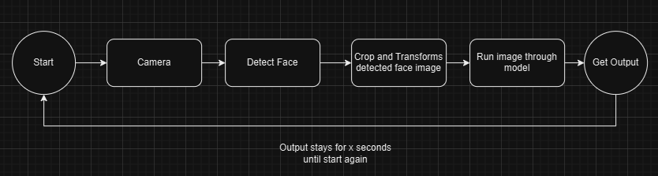

# Face-Expression Detector

This project uses my interpretation of the ResEmoteNet architecture from the paper ResEmoteNet: Bridging Accuracy and Loss Reduction in Facial Emotion Recognition (https://arxiv.org/abs/2409.10545 code can be found here https://github.com/ArnabKumarRoy02/ResEmoteNet.git) where I made some changes (not much) from the original code. The data used for the training of the model is the FER2013 dataset which can be found here https://www.kaggle.com/datasets/msambare/fer2013.


## 1. Environment and Installation


### Dependencies Setup

You would first need to clone the repo by doing 
```bash
git clone https://github.com/Pndu30/Face-Expression-Detector.git
```

Then, you can use Conda to make an environment or just download the requirements locally by doing
(Since I am using Python 3.12.4 to run this. You can install this by doing)
```bash
conda create --n "face_dect"
conda activate face_dect
conda install python=3.12.4
```

Then
```bash
pip install -r requirement.txt
```


## 2. Training the model


Although I have not been able to replicate the accuracy shown in the paper, I was able to reach an accuracy of 54.87% and F1-Score of 0.5139 with a seed of 42 with the FER2013 dataset using the SGD optimizer. Using the Adam optimizer I got a worse result which is 35.08% accuracy and 0.3023 F1-Score. These training was carried out with an NVDIA GTX1650 GPU on my laptop. The weights for these can be found [here](https://drive.google.com/drive/folders/1FEjaAr4Oo6blp9uZK5PvYA88xGBdzRoL?usp=sharing) 


If you do want to train the model by yourself, you can the cells in the training.ipynb notebook and change the hyperparameters as you wish


## 3. Running the cam


The control flow of the cam can be seen in the flowchart below where the x here is defaulted at 2 seconds




To run the program, all you have to do is run 
```bash
python main.py
```

And to stop the program, all you have to do is either click the **Enter** key or **Ctrl + C**


## 4. Note
**I have not been able to get the model to infer correctly as it seems the model keeps predicting almost the same values every inference. I might come back in the future and use another architecture for this or retrain the model when I have a better GPU.**


## 5. Sources and Citations


```text
@ARTICLE{10812829,
  author={Roy, Arnab Kumar and Kathania, Hemant Kumar and Sharma, Adhitiya and Dey, Abhishek and Ansari, Md. Sarfaraj Alam},
  journal={IEEE Signal Processing Letters}, 
  title={ResEmoteNet: Bridging Accuracy and Loss Reduction in Facial Emotion Recognition}, 
  year={2024},
  pages={1-5},
  keywords={Emotion recognition;Feature extraction;Convolutional neural networks;Accuracy;Training;Computer architecture;Residual neural networks;Facial features;Face recognition;Facial Emotion Recognition;Convolutional Neural Network;Squeeze and Excitation Network;Residual Network},
  doi={10.1109/LSP.2024.3521321}
}
```